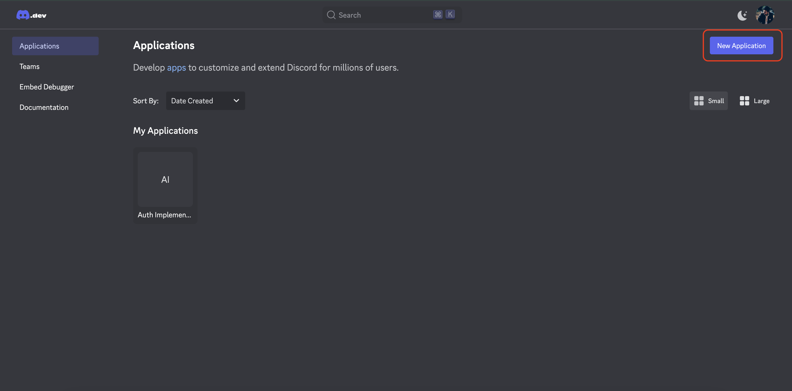
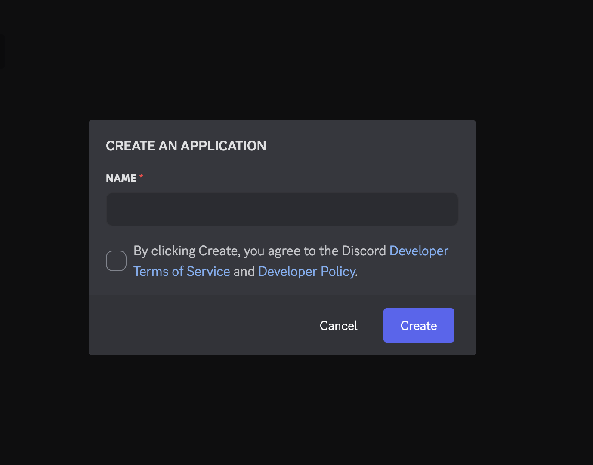
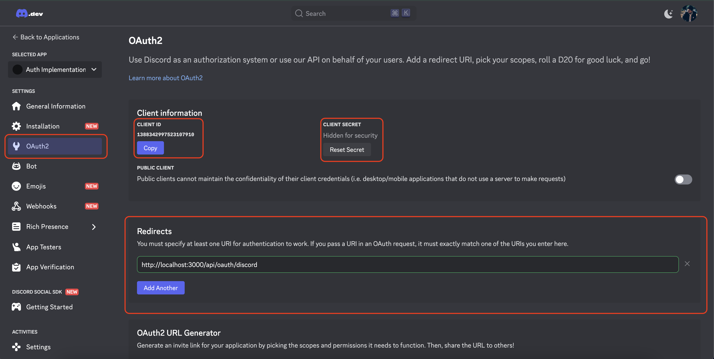

# Getting Started with Discord for OAuth2 :

#### Step 1 : Sign-In (If you already have account) or Sign-Up (If you don't have account) : 

https://discord.com/developers

#### Step 2 : Create a New Application : 

#### Step 3 : Name your application and click `Create` button:

#### Step 4 : Copy Client Id and Client secret and paste it in `.env` : 

And also set the Redirectio link to http://localhost:3000/api/oauth/discord and save the information.