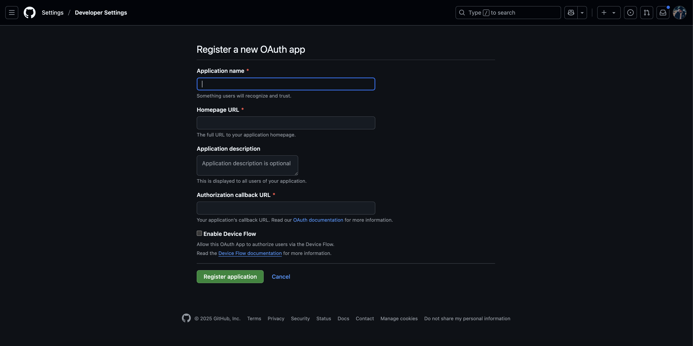
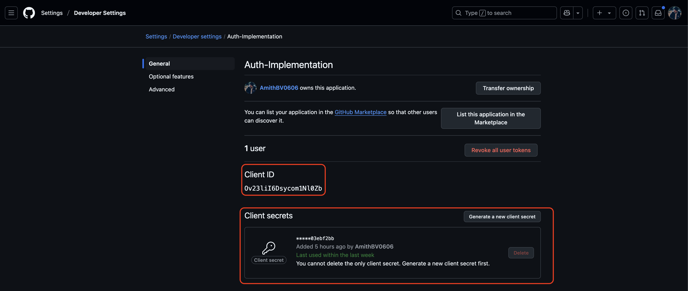

# Getting Started with GitHub for OAuth2 :

#### Step 1 : In the upper-right corner of any page on GitHub, click your profile photo, then click  Settings.

#### Step 2 : In the left sidebar, click  `<> Developer settings`.

#### Step 3 : In the left sidebar, click OAuth apps.

#### Step 4 : Click New OAuth App.

#### Step 5 : In "Application name", type the name of your app.

#### Step 6 : In "Homepage URL", type the full URL to your app's website.

http://localhost:3000/

#### Step 7 : Optionally, in "Application description", type a description of your app that users will see.

#### Step 8 : In "Authorization callback URL", type the callback URL of your app.

http://localhost:3000/api/oauth/github

#### Step 9 : If your OAuth app will use the device flow to identify and authorize users, click Enable Device Flow. For more information about the device flow, see Authorizing OAuth apps.

#### Step 10 : Click Register application.

#### Step 11 : Copy the Client Id and Client Secret and paste it in `.env` :

