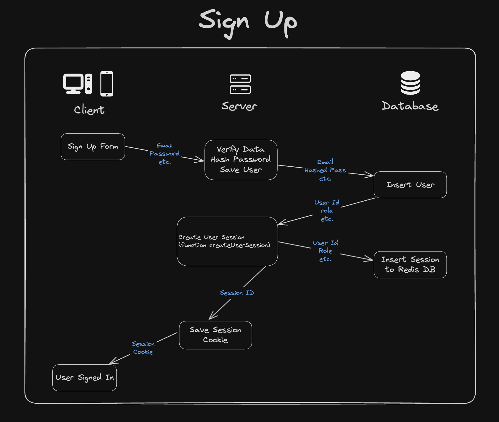
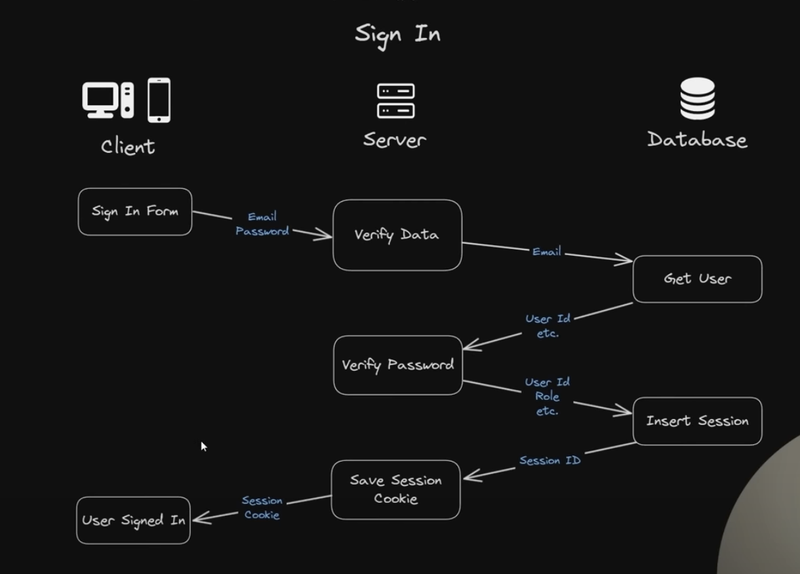
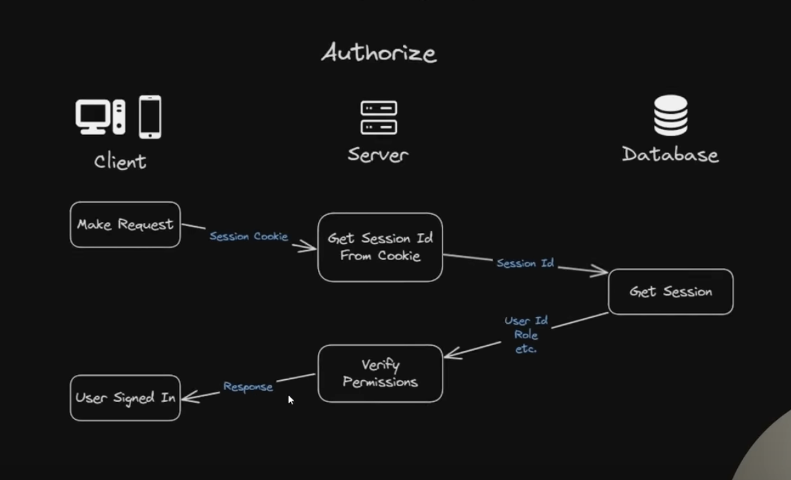
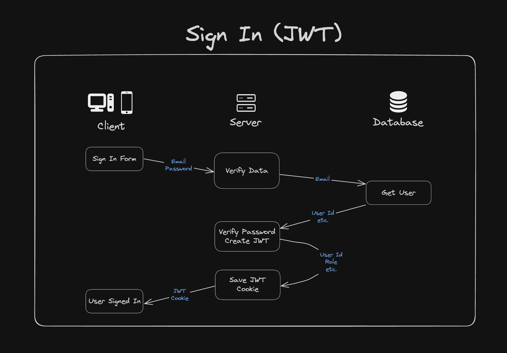
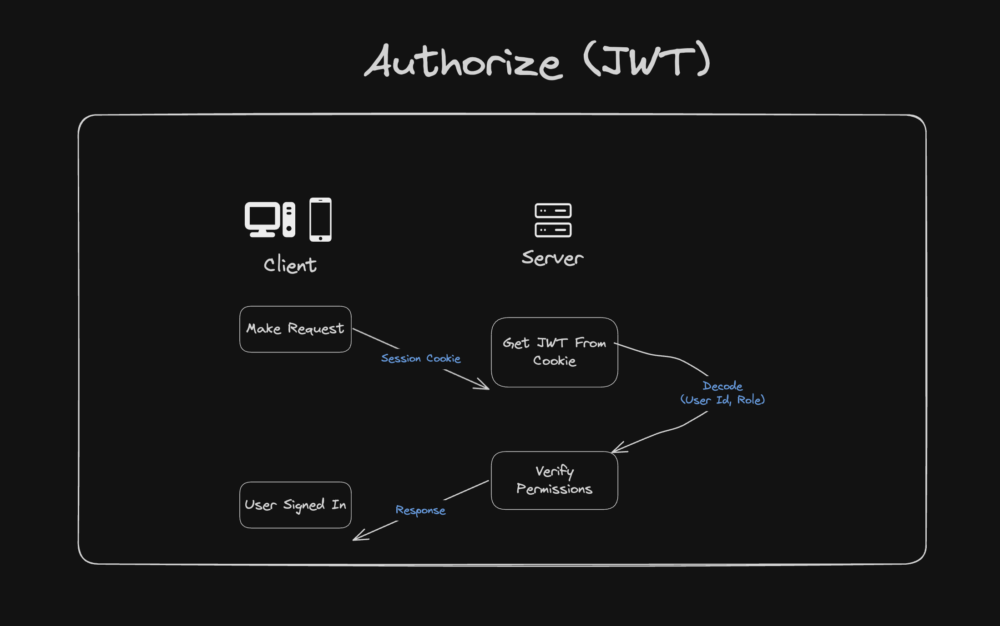
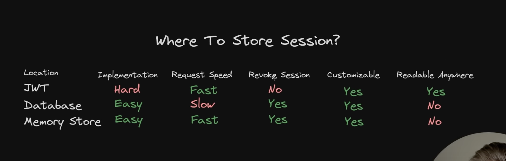

# Auth Implementation


A full-featured custom Sign-In, Sign-Up and OAuth2 authentication implementation using **Next.js**, **PostgreSQL**, **Redis**, and **Shadcn-UI**. 

This project demonstrates how to securely integrate third-party OAuth providers (like Discord and GitHub), handle PKCE (Proof Key for Code Exchange), manage sessions, and connect users to persistent database records.

# Architecture :

## Auth Implementation with database and in-memory store(Redis) :

### Sign Up :



### Sign In :



### Authorize :



## Auth Implementation using JWT's (Not Recommended) :

### JWT Sign In :



### Authorize using JWT's :



##

### Where to store the session?




---

### ⚙️ Tech Stack :

- **Frontend**: [Next.js](https://nextjs.org/), [TailwindCSS](https://tailwindcss.com/), [Shadcn-UI](https://ui.shadcn.com/)
- **Backend**: NextJs API, Server actions and OAuth 2.0 with PKCE flow.
- **Database**: [PostgreSQL](https://www.postgresql.org/) (via Drizzle ORM)
- **Session Store**: [Redis](https://redis.io/)
- **Types**: TypeScript
- **ORM**: [Drizzle](https://orm.drizzle.team/)

---


### 🔐 Features :

- OAuth login with support for providers (Discord, GitHub)
- PKCE implementation for enhanced security
- Secure cookie handling (state, code verifier)
- Session creation and persistence with Redis
- Type-safe schema validation using Zod
- Dynamic provider routing via Next.js App Router
- Seamless user onboarding (new users are created if they don’t exist)
- Error handling with custom error classes

---

### 🧱 Folder Structure :

```
src/
├── app/
│ └── api/
│ └── oauth/[provider]/route.ts # Handles OAuth callback
├── auth/
│ ├── core/
│ │ ├── oauth/
│ │ │ ├── base.ts # OAuthClient class
│ │ │ └── error.ts # Custom error classes
│ │ └── oauth-security/
│ │ └── helper.ts # State, codeVerifier, and client setup
│ ├── providers/
│ │ └── discord.ts # Discord OAuth client factory
│ └── types.ts # Shared types
├── drizzle/
│ ├── db.ts # Database connection
│ └── schema.ts # DB schema definitions
```

---

### 🏁 Getting Started : 

#### 1. Clone the repository :
```bash
git clone https://github.com/AmithBV0606/Auth-Implementation.git
cd auth-implementation
```

#### 2. Install dependencies :
```bash
pnpm install
# or
npm install (Recommended)
```

#### 3. Set up your .env file

Copy the content from `.env.local` to `.env`.

#### 4. Get `REDIS_URL` and `REDIS_TOKEN` from Upstash :

[Redis Setup](REDIS.md)

#### 5. Setup Discord for OAuth : 

[Discord Setup](DISCORD.md)

#### 6. Setup GitHub for OAuth : 
[GitHub Setup](GITHUB.md)

#### 7. Setup postgreSQL using docker : 

- Pull the image :
```bash
docker pull postgres:latest
```

- Run the container : 
```bash
docker run --name <container_name> -e POSTGRES_PASSWORD=mysecretpassword -p 5432:5432 -d postgres
```

NOTE : Don't change the password of the container. If you do, make sure to update the password in `.env` file.

#### 8. Setup drizzle and run migrations : 
```bash
npm run db:generate
npm run db:migrate
```

#### 9. If you want to see the database UI : 
```bash
npm run db:studio
```

#### 10. Run the project in dev mode : 
```bash
npm run dev
```

---

### 🧪 Testing OAuth Flow : 

- Navigate to /sign-in
- Choose Discord or GitHub as the provider
- You’ll be redirected and authenticated
- A session is created, and the user is persisted in the database

---

### 🙋‍♂️ Author

Amith B V

Feel free to reach out or connect on LinkedIn or GitHub.