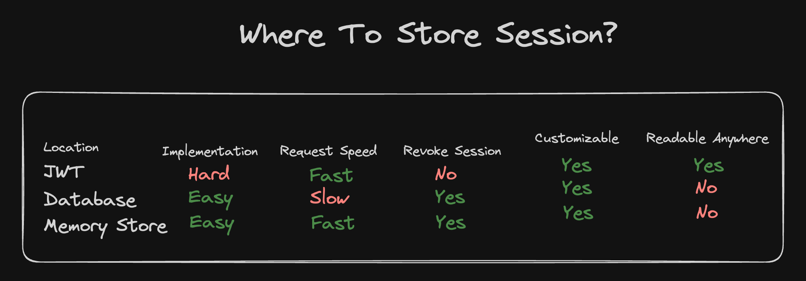

# Auth Implementation

Building an Authentication Systems from scratch.

## Auth Implementation with database and in-memory store(Redis) :

### Sign Up :

### Sign In :

### Authorize :

## Auth Implementation using JWT's (Not Recommended) :

### JWT Sign In :

### Authorize using JWT's :

##

### Where to store the session?

