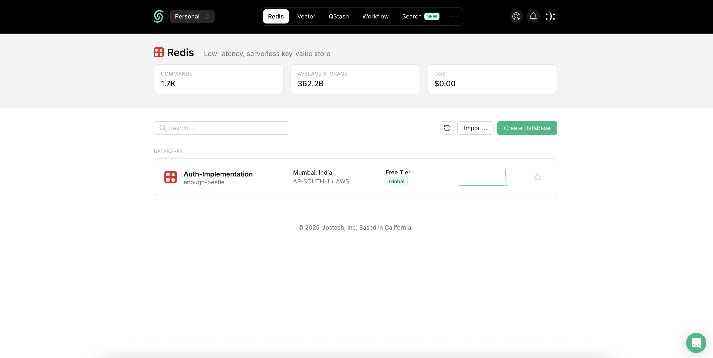
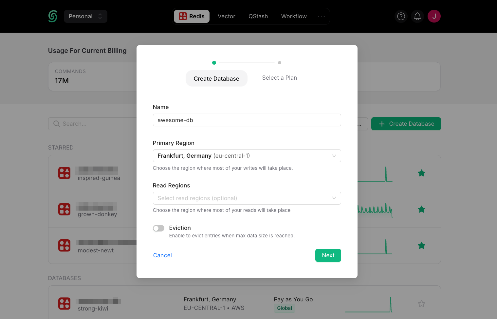
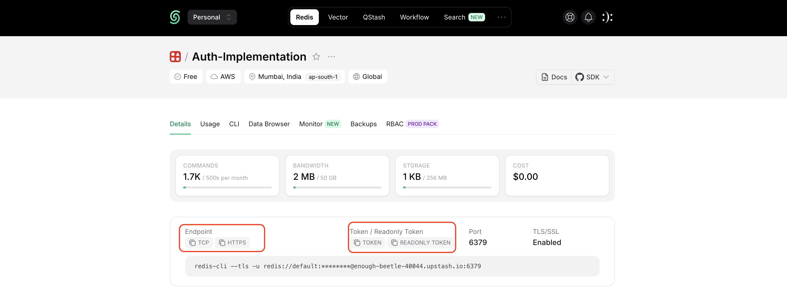

# Getting Started with Upstash Redis database :

#### Step 1 : Sign-In (If you already have account) or Sign-Up (If you don't have account) : 

Link : https://upstash.com/

#### Step 2 : Select the Redis service and create the database : 

Once you’re logged in, create a database by clicking `+ Create Database` in the upper right corner. A dialog opens up :

**Database Name** : Enter a name for your database.

**Primary Region and Read Regions** : For optimal performance, select the Primary Region closest to where most of your writes will occur. Select the read region(s) where most of your reads will occur.

Once you click `Next` and select a plan, your database is running and ready to connect.

#### Step 3 : Connect to Your Database

You can connect to Upstash Redis with any Redis client. 

Copy the `Endpoint` and `Token` from the dashboard and paste it in `.env` :

